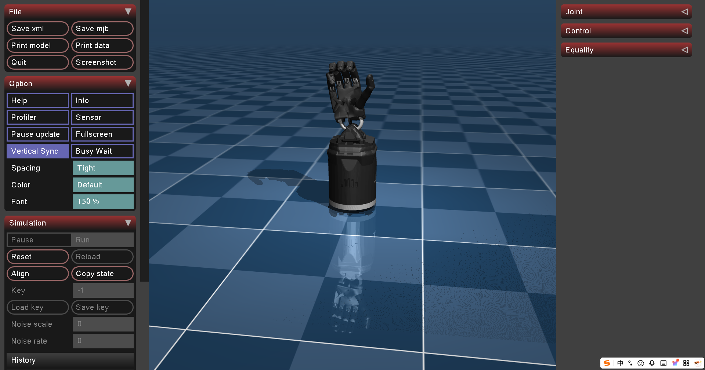

[中文](README.zh.md) | English

# qsq-retargeting

[](LICENSE)

High-precision hand pose retargeting system. Based on adaptive analytical optimization with support for Shadow Hand (MuJoCo Menagerie) and Apple Vision Pro hand tracking for real-time teleoperation.

## Demo

[](https://www.bilibili.com/video/BV1YfFXzXEwr)

## Features

- **Shadow Hand Support**: Shadow Hand with MuJoCo Menagerie high-quality meshes
- **High-Precision Pinch**: Adaptive optimization for accurate finger-to-thumb contact
- **Real-time Performance**: Analytical gradients + NLopt SLSQP (~2ms per frame)
- **Multiple Input Sources**: Apple Vision Pro, laptop camera (MediaPipe), recorded data replay
- **Tendon Coupling**: Shadow Hand J2-J1 coupling constraint for MuJoCo compatibility

## Table of Contents

- [Supported Robots](#supported-robots)
- [Repository Structure](#repository-structure)
- [Installation](#installation)
- [Quick Start](#quick-start)
- [Configuration](#configuration)
- [API Reference](#api-reference)
- [Optimizer Details](#optimizer-details)
- [Citation](#citation)
- [Acknowledgement](#acknowledgement)
- [Contact](#contact)

## Supported Robots

| Robot | Config File | Description |
|-------|-------------|-------------|
| **Shadow Hand** | `shadow_hand_menagerie.yaml` | Shadow Hand with MuJoCo Menagerie meshes (default) |

## Repository Structure

```text
├── qsq_retargeting/
│   ├── opt/                          # Optimizer implementations
│   │   ├── base.py                   # Base optimizer with FK/Jacobian
│   │   └── adaptive_analytical.py    # Adaptive optimizer with analytical gradients
│   └── shadow_hand_menagerie/        # Shadow Hand URDF for MuJoCo Menagerie
│       ├── left_hand_mj.urdf
│       └── right_hand_mj.urdf
├── example/
│   ├── teleop_sim.py                 # MuJoCo simulation demo
│   ├── teleop_real.py                # Real hardware control
│   ├── input_devices/                # Input device modules
│   ├── config/                       # YAML configurations
│   └── data/                         # Sample recordings
└── requirements.txt
```

## Installation

### Prerequisites

- Python >= 3.10
- (Optional) Apple Vision Pro with [Tracking Streamer](https://apps.apple.com/us/app/tracking-streamer/id6478969032) app

### Install

```bash
git clone https://gitee.com/gx_robot/qsq-retargeting.git
cd qsq-retargeting
pip install -r requirements.txt
pip install -e .
```

### Troubleshooting

**pinocchio Installation**: If PyPI mirror fails:
```bash
pip install pin==3.8.0 -i https://pypi.org/simple
```

**macOS MuJoCo**: Use `mjpython` instead of `python`:
```bash
mjpython example/teleop_sim.py --play example/data/avp1.pkl
```

## Quick Start

### Shadow Hand (Default)

```bash
cd example

# Replay recorded data
python teleop_sim.py --play data/avp1.pkl --hand right

# Real-time with laptop camera (MediaPipe)
python teleop_sim.py --input camera --hand right

# Real-time with Vision Pro
python teleop_sim.py --input visionpro --ip <vision-pro-ip> --hand right
```

### Real Hardware

```bash
cd example
python teleop_real.py --play data/avp1.pkl --hand right

# Linux USB permission
sudo chmod a+rw /dev/ttyUSB0
```

### Command Reference

| Option | Default | Description |
|--------|---------|-------------|
| `--config` | `config/adaptive_analytical_avp.yaml` | Configuration file |
| `--hand` | `left` (sim) / `right` (real) | Hand side (`left`/`right`) |
| `--input` | - | Input type (`visionpro`/`camera`/`mediapipe_replay`) |
| `--play FILE` | - | Replay recording (shortcut for `--input mediapipe_replay`) |
| `--ip` | `192.168.50.127` | Vision Pro IP |
| `--speed` | `1.0` | Playback speed |
| `--record` | - | Record input data |
| `--output FILE` | - | Output file path for recording |
| `--no-loop` | - | Disable looping for replay |

## Configuration

### Config File Structure

```yaml
optimizer:
  type: "AdaptiveOptimizerAnalytical"

robot:
  type: "shadow_hand_menagerie"

retarget:
  # Loss weights
  w_pos: 1.0              # Tip position weight
  w_dir: 5.0              # Tip direction weight
  w_pinch: 50.0           # Pinch distance weight (higher = more precise pinch)
  w_coupling: 100.0       # Tendon coupling weight (Shadow Hand only)
  w_full_hand: 1.0        # Full hand weight

  # Huber loss thresholds
  huber_delta: 2.0        # Position threshold (cm)
  huber_delta_dir: 0.5    # Direction threshold

  # Regularization
  norm_delta: 0.04        # Velocity smoothing

  # Scaling
  scaling: 0.81           # MediaPipe to robot scale (Shadow Hand ~81% of MediaPipe)

  # Coordinate alignment
  mediapipe_rotation:
    x: 0.0
    y: 0.0
    z: -90.0              # Shadow Hand requires -90° Z rotation

  # Pinch thresholds (cm)
  pinch_thresholds:
    index:  { d1: 2.0, d2: 4.0 }
    middle: { d1: 2.0, d2: 4.0 }
    ring:   { d1: 2.0, d2: 4.0 }
    pinky:  { d1: 2.0, d2: 4.0 }

  # Low-pass filter (0~1, smaller = smoother)
  lp_alpha: 0.4
```

### Key Parameters

| Parameter | Description |
|-----------|-------------|
| `w_pinch` | Pinch precision weight. Higher values (50-100) for precise grasping tasks |
| `w_coupling` | Shadow Hand tendon coupling. Set 100+ to match MuJoCo simulation |
| `scaling` | Hand size ratio. Shadow Hand ≈ 0.81 |
| `mediapipe_rotation.z` | Coordinate alignment. Shadow Hand = -90° |

## API Reference

### Basic Usage

```python
from qsq_retargeting import Retargeter

# Load from config file
retargeter = Retargeter.from_yaml("config/shadow_hand_menagerie.yaml", hand_side="right")

# Retarget: (21, 3) MediaPipe keypoints -> joint angles
qpos = retargeter.retarget(raw_keypoints)

# With verbose output
qpos, info = retargeter.retarget_verbose(raw_keypoints)
print(f"Cost: {info['cost']:.4f}")
print(f"Pinch alphas: {info['pinch_alphas']}")
```

### Advanced Usage

```python
# Direct optimizer access
optimizer = retargeter.optimizer

# Compute cost for given pose
cost = optimizer.compute_cost(qpos, mediapipe_keypoints)

# Get timing statistics
stats = optimizer.get_timing_stats()
print(f"Average time: {stats.avg_total_ms:.2f} ms")
```

## Optimizer Details

### Optimization Formulation

```
min_q  L(q) + λ||q - q_prev||²
s.t.   q_min ≤ q ≤ q_max
```

### Loss Function

```
L = Σᵢ [αᵢ · L_tip_dir_vec + (1-αᵢ) · L_full_hand] + w_pinch · L_pinch + w_coupling · L_coupling
```

- **L_tip_dir_vec**: Position + direction matching (for pinch gestures)
- **L_full_hand**: Full hand vector matching (for open hand)
- **L_pinch**: Direct thumb-to-finger distance matching
- **L_coupling**: |J2 - J1| penalty for Shadow Hand tendons

### Adaptive Blending

```
αᵢ = 1.0    if dᵢ < d1  (pinching → TipDirVec mode)
αᵢ = 0.0    if dᵢ > d2  (open → FullHandVec mode)
αᵢ = lerp   otherwise
```

Where `dᵢ` is thumb-to-finger distance.

## Citation

```bibtex
@software{qsq2025retargeting,
  title={Hand Retargeting},
  author={QSQ},
  year={2025},
  url={https://gitee.com/gx_robot/qsq-retargeting},
}
```

## Acknowledgement

- [MuJoCo](https://mujoco.org/) - Physics simulation
- [MuJoCo Menagerie](https://github.com/google-deepmind/mujoco_menagerie) - Shadow Hand models
- [dex-retargeting](https://github.com/dexsuite/dex-retargeting) - Retargeting algorithms
- [DexPilot](https://arxiv.org/abs/1910.03135) - Vision-based teleoperation
- [VisionProTeleop](https://github.com/Improbable-AI/VisionProTeleop) - Apple Vision Pro streaming
- [wuji-retargeting](https://github.com/wuji-technology/wuji-retargeting) - Wuji retargeting

## Contact

For questions, please open an issue on [Gitee](https://gitee.com/gx_robot/qsq-retargeting/issues) or contact the author via 932851972@qq.com.
